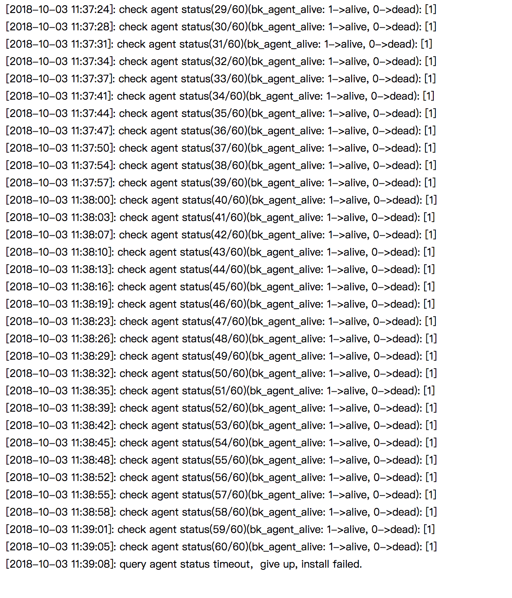

# Issues unsolved

## Windows agent install 

1. windows（无cygwin）

   在安装最后有用到cp指令拷贝一些核心指令到C:\windows\system32下面，但windows本身是没有cp指令的。暂时判断为脚本的此逻辑分支有误。

2. windows（cygwin）安装及服务启动正常。但它依赖的一些端口及服务是无cygwin下需要的，即当前需要同时满足“有、无cygwin”下的条件，才可正常安装，且当前只有选择windows（cygwin）才能正常完成部署。

## Windows agent uninstall

Windows server cannot uninstall/remove blueking agent 

If directly delete agent info on DB side, then proxy will still keep finding the lost agent. In proxy's /etc/log/gse/transit-\[date\].log can see this error.

## Linux agent 

"stop gse\_agent ...Failed" when reinstall agent, need check script.

##   Windows Agent Install setup files will be left

C:\gse\_client-windows-x86.tgz

C:\gse\_client-windows-x86\_64.tgz

C:\winagent\_install.zip

C:\7z.dll

C:\7z.exe

C:\normaliz.dll

## CMDB too long to response

Paas login will time out, and unable to login last several minutes.

C:\winagent\_install

